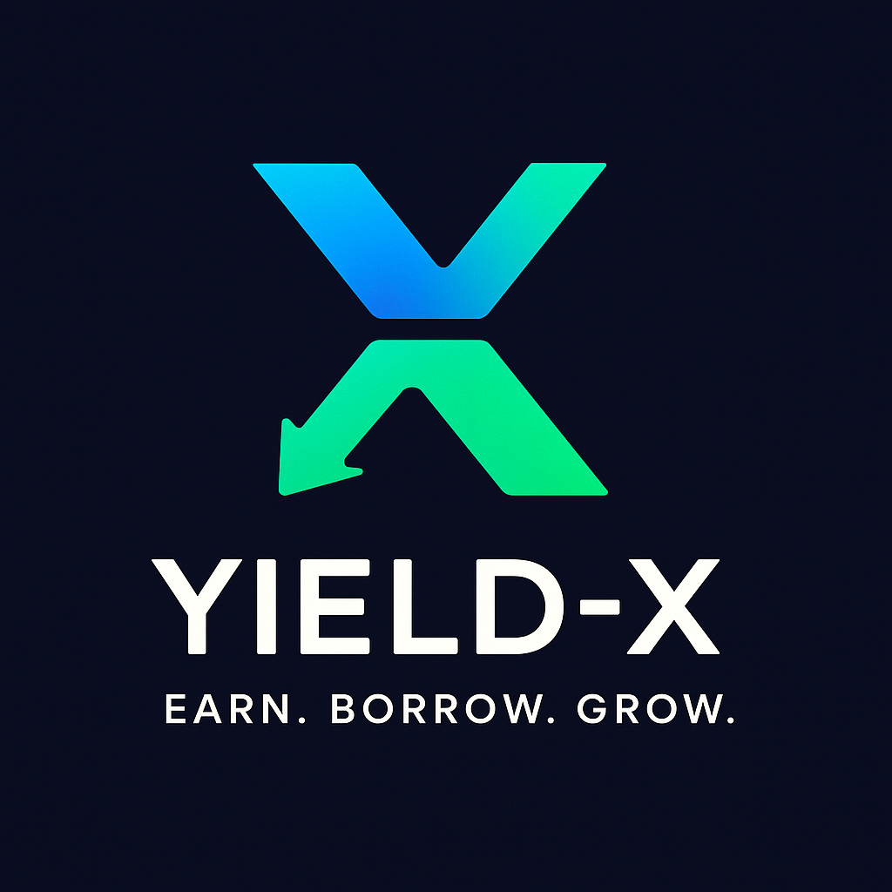
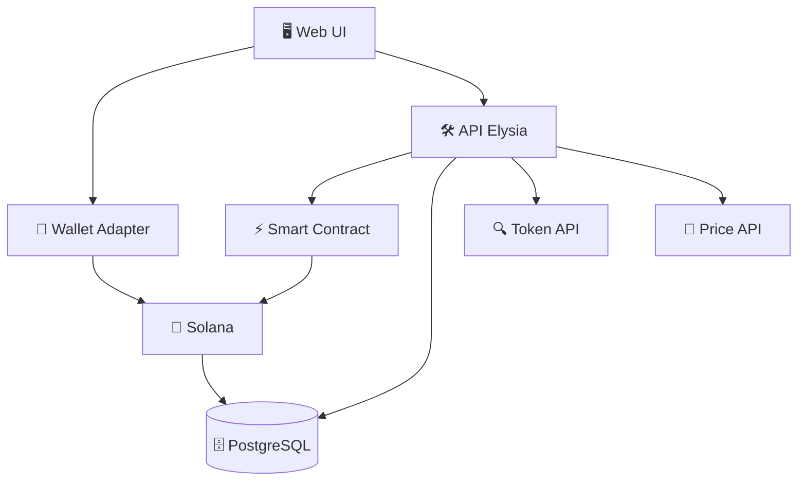

<div align="center">
  

  <p>
    <a href="https://github.com/MatthieuLvsr/yield-x/blob/develop/LICENSE">
      
    </a>
    <a href="https://www.npmjs.com/package/bun">
      
    </a>
    <a href="https://github.com/biomejs/biome">
      
    </a>
    <a href="https://solana.com/">
      
    </a>
    <a href="https://github.com/MatthieuLvsr/yield-x/releases">
      
    </a>
  </p>
</div>

# 🚀 Yield-X

> 💡 **Yield-X** is an all-in-one DeFi platform: Solana smart contract, API backend, and Next.js interface.

---

## 🏗️ Architecture

<details>
<summary>🗺️ <b>Detailed Architecture</b></summary>



</details>

---

## ⚡ Quick Start

Install dependencies and start all services:

```bash
bun install
bun dev
```

This will start:

- 🛠️ API server with Prisma Studio
- 🖥️ Frontend development server
- 🗄️ Database migrations

---

## 🗂️ Project Structure

- `apps/contract` — ⚡ Solana smart contract (Anchor)
- `apps/api` — 🛠️ Backend API (Elysia + Prisma)
- `apps/frontend` — 🖥️ Web interface (Next.js + React)

---

## ⚡ apps/contract

Solana smart contract built with Anchor framework.

---

## 🧰 Prerequisites

- [🍞 Bun](https://bun.sh/) v1.0+
- [🟩 Node.js](https://nodejs.org/) v18+
- [💸 Solana CLI](https://docs.solana.com/cli/install-solana-cli-tools)
- [⚓ Anchor](https://www.anchor-lang.com/docs/installation) v0.28+
- [🗄️ PostgreSQL 14+](https://www.postgresql.org/)

### Local Development

```bash
cd apps/contract

# Start local Solana validator
solana-test-validator

# Set cluster to localhost
solana config set -ul

# Build and test
anchor build
anchor test --skip-local-validator

# Deploy locally
anchor deploy
```

### Deploy to Devnet

1. Update `Anchor.toml`:

```toml
[provider]
cluster = "Devnet"
wallet = "~/.config/solana/id.json"
```

2. Rebuild and deploy:

```bash
anchor build
anchor deploy
```

Available scripts:

- `bun run build` - Build the contract
- `bun run test` - Run tests with local validator
- `bun run test:unit` - Run tests without validator
- `bun run start:validator` - Start Solana test validator
- `bun run stop:validator` - Stop Solana test validator

## apps/api

Backend API built with Elysia and Prisma for database management.

### Setup

```bash
cd apps/api

# Run database migrations
bun run db:migrate

# Seed the database (optional)
bun run seed

# Start development server
bun run dev
```

Available scripts:

- `bun run dev` - Start development server with auto-reload
- `bun run db:migrate` - Run database migrations
- `bun run db:reset` - Reset database
- `bun run db:generate` - Generate Prisma client
- `bun run seed` - Seed database with sample data

The API includes:

- OpenAPI documentation via Swagger
- CORS support
- OpenTelemetry integration

## apps/frontend

Next.js frontend with React 19, Tailwind CSS, and Solana wallet integration.

### Setup

```bash
cd apps/frontend

# Start development server
bun run dev
```

### Environment Modes

**Development (real data):**

```bash
bun run dev
```

**Demo mode (mock data):**

```bash
bun run dev:fake
```

Available scripts:

- `bun run dev` - Development server with real data
- `bun run dev:fake` - Development server with mock data
- `bun run build` - Production build
- `bun run build:fake` - Production build with mock data
- `bun run start` - Start production server

Features:

- Solana wallet integration
- 3D visualizations with Three.js
- Interactive charts with Highcharts
- Responsive design with Tailwind CSS
- Component library with Radix UI

---

## 🗺️ Infrastructure Overview

```mermaid
flowchart TD
    subgraph Cloud
        CDN[CDN / Static Hosting]
        API[API Server (Elysia)]
        DB[(PostgreSQL DB)]
    end
    subgraph Blockchain
        Solana[Solana Cluster]
        Validator[Local Validator]
    end
    subgraph Frontend
        Browser[User Browser]
        Wallet[Solana Wallet]
    end
    Browser -- "HTTPS" --> CDN
    Browser -- "API Calls" --> API
    API -- "DB Queries" --> DB
    API -- "RPC" --> Solana
    Wallet -- "Sign Tx" --> Solana
    Validator -.-> Solana
    CDN -- "Deploy" --> Frontend
```

## Development

### Code Quality

The project uses Ultracite for formatting and linting:

```bash
bun run format
```

### Git Hooks

Lefthook is configured for pre-commit hooks to ensure code quality.

## Requirements

- [Bun](https://bun.sh/) - JavaScript runtime and package manager
- [Node.js](https://nodejs.org/) - For compatibility
- [Solana CLI](https://docs.solana.com/cli/install-solana-cli-tools) - For contract development
- [Anchor](https://www.anchor-lang.com/docs/installation) - Solana framework
